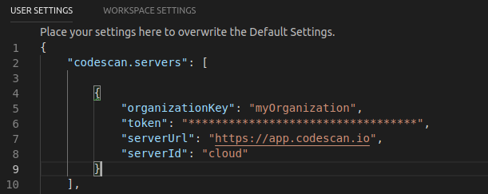
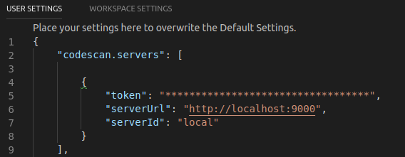
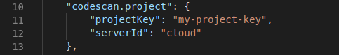
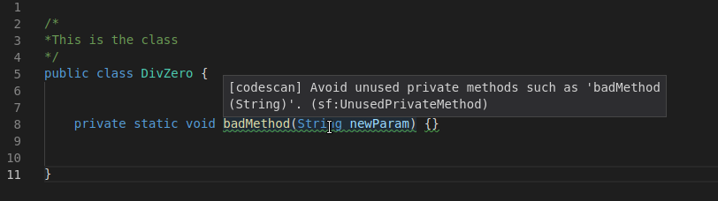

# CodeScan for Visual Studio Code

CodeScan is a Visual Studio Code extension that provides on-the-fly feedback to developers on new bugs and quality issues injected into Apex and VisualForce code.

## How it works

Simply open a Apex or VisualForce file, start coding, and you will start seeing issues reported by CodeScan. Issues are highlighted in your code, and also listed in the 'Problems' panel.

You can access the detailed rule description directly from your editor, using the provided contextual menu.

You can find all available rules descriptions on the dedicated [CodeScan website](http://www.code-scan.com/tutorials/vscode).

# Prerequisites
You will need:

* A working SonarQube (6.7.4+) installation
* A recent version of VS Code installed (v1.12 or above).
* A licensed version of CodeScan plugin to get started (see <a href="https://www.code-scan.com/overview/installing-all/" >here</a>

# Installation

* In VS Code, go to the Marketplace and download CodeScan.

* Restart VS Code.

* In the VS Code Settings, search CodeScan.

* Click "Edit in settings.json" under any setting and copy the codescan.servers and codescan.project settings to the right hand pane.

* Edit the following in codescan.servers.

* For CodeScan Cloud

    - Add organizationKey as your CodeScan Cloud organization key.
    - Add token with a token generated in here in CodeScan Cloud.
    - Add serverUrl as https://app.codescan.io/
    - Add serverId with a value you will remember.

   

* For Self-Hosted CodeScan

    - Add token with a token generated in SonarQube.
    - Add serverUrl as your SonarQube server URL (Default is http://localhost:9000).
    - Add serverId with a value you will remember.

* Edit the following in codescan.project
    - Add projectKey with the key of the project you would like to use the settings from.
    - Add serverId with the serverId you used when editing your codescan.servers settings.

* Now hit Ctrl+Shift+P (Windows/Linux) or Shift+Command+P(Mac) to open the Command Palette.

* Type in CodeScan to bring up the CodeScan commands and run “Update CodeScan binding to SonarQube/CodeScan Cloud”. If any changes are made on the SonarQube server you should repeat this step.

* Open a file, you should see the issues in your code underlined.

# Troubleshooting

You can check for the analysis status from the output window under CodeScan.

You can check for any errors here by going to Help > Toggle Developer Tools to bring up the console.

### Connected mode

You can connect CodeScan to SonarQube >= v6.7.4 or CodeScan Cloud to benefit from the same rules and settings that are used to inspect your project on the server. CodeScan then hides in VSCode the issues that are marked as **Won’t Fix** or **False Positive**.

To configure the connection, have a look at CodeScan in default user settings.

If you change something on the server such as the quality profile, you can trigger an update of the local cache using the "Update CodeScan binding to SonarQube/CodeScan Cloud" command on the command palette (search for "codescan").

For security reasons, the token should not be stored in SCM with workspace settings.

## Contributions and license

CodeScan for Visual Studio Code is open source under the LGPL v3 license. Feel free to submit Pull Requests.

## Feedback

The preferred way to discuss about CodeScan is by posting on the [CodeScan Support Page](http://www.code-scan.com/help/support). Feel free to ask questions, report issues, and give suggestions.
