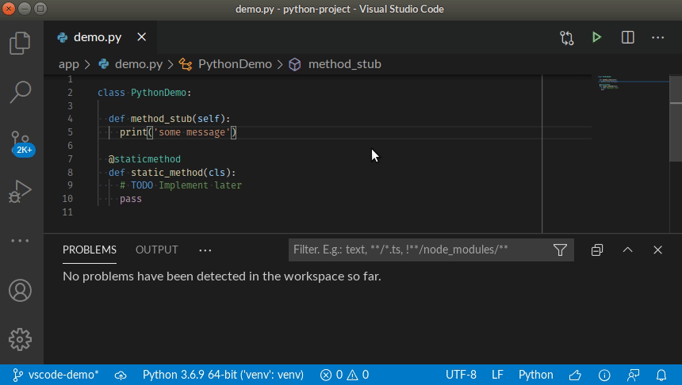

# CodeScan for Visual Studio Code

CodeScan is a Visual Studio Code extension that provides on-the-fly feedback to developers on new bugs and quality issues injected into Apex and VisualForce code.

## How it works

Simply open a Apex or VisualForce file, start coding, and you will start seeing issues reported by CodeScan. Issues are highlighted in your code, and also listed in the 'Problems' panel.

You can access the detailed rule description directly from your editor, using the provided contextual menu.

## Requirements

The CodeScan language server needs a Java Runtime (JRE) 11+. If one is already installed on your computer, CodeScan should automatically find and use it.

If a suitable JRE cannot be found at the usual places, CodeScan will ask for your permission to download and manage its own version.

Finally, you can explicitly set the path where the JRE is installed using the `codescan.ls.javaHome` variable in VS Code settings. For instance:

    {
        "codescan.ls.javaHome": "C:\\Program Files\\Java\\jre-11.0.11"
    }
    
## Codescan self hosted version specific requirements
A licensed version of CodeScan plugin to get started (see <a href="https://knowledgebase.autorabit.com/codescan/docs/installing-codescan-self-hosted" >here</a>)

### JS/TS analysis specific requirements

To analyze JavaScript and TypeScript code, CodeScan requires Node.js executable. It will be autodetected, or you can force the location using:

    {
        "codescan.pathToNodeExecutable": "/home/julien/.nvm/versions/node/v11.12.0/bin/node"
    }

### Java analysis specific requirements

To enable the support for Java analysis, you need the [Language support for Java](https://marketplace.visualstudio.com/items?itemName=redhat.java) VSCode extension (version 0.56.0 or higher). You also need to be in [standard mode](https://code.visualstudio.com/docs/java/java-project#_lightweight-mode).

## Server Connection mode

You can connect CodeScan VS code extension to SonarQube >= 7.9 or Codescan cloud and bind your workspace folders to a project to benefit from the same rules and settings that are used to inspect your project on the server. CodeScan then hides in VSCode the issues that are marked as **Won’t Fix** or **False Positive**.

The first step is to configure connection details (user token, Codescan server URL and Codescan organization). For security reasons, the token should not be stored in SCM with workspace settings. That's why we suggest to configure them in VSCode user settings.

Example for Codescan Cloud:

    {
        "codescan.servers": [
          {
            "serverId": "my_orga_in_app.codescan.io",
            "serverUrl": "https://app.codescan.io",
            "organizationKey": "my_organization",
            "token": "V2VkIE1..."
          }
        ]
    }

Example for Self-Hosted CodeScan:

    {
        "codescan.servers": [
          {
            "serverId": "my_sonarqube",
            "serverUrl": "https://sonar.mycompany.com",
            "token": "V2VkIE1..."
          }
        ]
    }

The second step is to configure the project binding. Example:

    {
        "codescan.project": {
            "serverId": "my_sonarqube",
            "projectKey": "the-project-key"
        }
    }

If you plan to use multiple connections, to different SonarQube servers and/or Codescan-Cloud organizations, simply give a unique `serverId` to each entry, and use them as reference in the binding.

Configuring a project binding at the workspace level mutes **Won’t Fix** and **False Positive** issues in any of the project's sub-folders added to the workspace. CodeScan will do its best to synchronize with the most appropriate branch from the server.

CodeScan keeps server side data in a local storage. If you change something on the server such as the quality profile, you can trigger an update of the local storage using the "CodeScan: Update all project bindings to SonarQube/CodescanCloud" command on the command palette (search for "codescan").

## Contributions and license

CodeScan for Visual Studio Code is open source under the LGPL v3 license. Feel free to submit Pull Requests.

## Feedback

The preferred way to discuss about CodeScan is by emailing us on the CodeScan Support Page: (support@codescan.io). Feel free to ask questions, report issues, and give suggestions.

